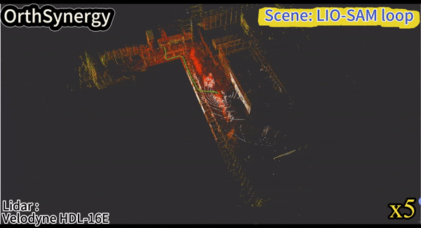
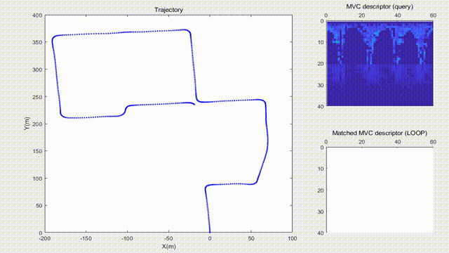
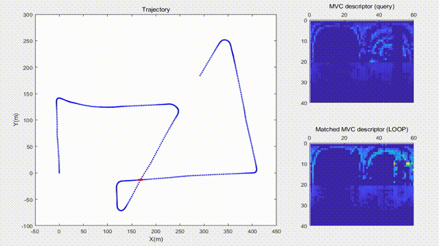
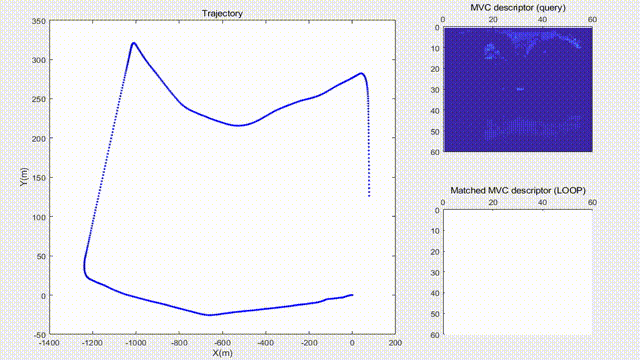
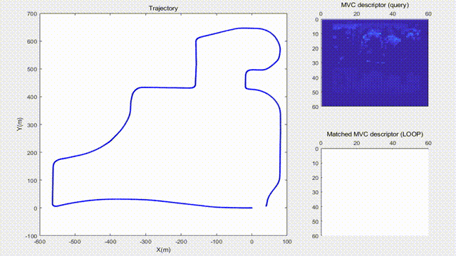

# OrthSynergy: Orthogonal Feature-based Global Descriptor for Loop Closure Detection in Large-scale Scenes
<br>

# :memo: To Do
- Release code of OrthSynergy！
- Implementation Instructions for SLAM System Integration！

# :sparkles: Loop Detection Visualization<br>
- Campus Loop Scenes<br>

 

# :white_check_mark: OrthSynergy Descriptors Visualization<br>
- Different testing environments and sensor types
 <br>
- MulRan Riverside02 and Kaist03 scene<br>
 <br>

# :rocket: SLAM System Integration<br>
- KITTI 00 and 13 scene<br>
 <br>
 <br>

# :hammer_and_wrench: Datasets Download and Preparation
To evaluate the LCD performance, you will need to **download** the required datasets.

- SemanticKITTI Dataset- [Baidu Drive](https://pan.baidu.com/s/1LL2LItLEQpOt4HLWodTpWQ?pwd=qaos)(access code: qaos).
<br> We have provided the groundtruth Pose of this dataset in Groundtruth_pose folder.
```
./
├── 
├── ...
└── data_path/
    ├──sequences
        ├── 00/          
        │   ├── velodyne/	
        |   |	├── 000000.bin
        |   |	├── 000001.bin
        |   |	└── ...
        │   └── labels/ 
        |       ├── 000000.label
        |       ├── 000001.label
        |       └── ...
        ├── 02/ 
        ├── 05/ 
        │   ├── velodyne/	
        |    	├── 000000.bin
        |    	├── 000001.bin
        |    	└── ...
        ├── 06/
        ├── ...

```
- MulRan Dataset- [download](https://sites.google.com/view/mulran-pr/home).
<br> We have provided the groundtruth Pose of this dataset in Groundtruth_pose folder. Sejong01 sequence can also be downloaded from [Google Drive](https://drive.google.com/file/d/17Lo-fgDgkeLxDTVdY-Sn7pj0xoeCL9nE/view?usp=sharing).
```
./
├── 
├── ...
└── data_path/
    ├──mulran
        ├── Sejong01/      
        │   	└── lidar/
	│		├── 000000.bin          
        |               ├── 000001.bin
	│		└── ...
        ├── Riverside02/
	|   	└── lidar/
	|		├── 000000.bin          
	|		├── 000001.bin
	|		└── ...
        ├── ...
```
- Freiburg Campus Dataset - [download](https://drive.google.com/file/d/1eJFcMEEcNQynoNqeYoyBIZi0I4Gs1mH6/view?usp=sharing).
<br> We have provided the groundtruth Pose of this dataset in Groundtruth_pose folder.
```
./
├── 
├── ...
└── data_path/
    ├──Freiburg
        └── lidar/   	
            	├── 000000.bin
                ├── 000001.bin
            	└── ...
```
- UrbanLoco Dataset - [download](https://github.com/weisongwen/UrbanLoco).
<br> We have provided the groundtruth Pose of this dataset in Groundtruth_pose folder. CALombardStreet sequence can also be downloaded from [Google Drive](https://drive.google.com/file/d/1-av6k8BvpDnchmYWyNnlD4foK5D2vCEe/view?usp=sharing).
```
./
├── 
├── ...
└── data_path/
    ├──UrbanLoco
        └── CALombardStreet/      
           	└── lidar/
                       ├── 000000.bin          
                       ├── 000001.bin
                       └── ...
```

The red trajectory indicates the route where loop closures have been detected.
## Acknowledgments
We thanks for the opensource codebases, [M2DP](https://github.com/LiHeUA/M2DP), [Scan Context](https://github.com/asdfghjkl623/scancontext/tree/master/matlab
), [NDD](https://github.com/zhouruihao1001/NDD) and [FreSCo](https://github.com/soytony/FreSCo).
